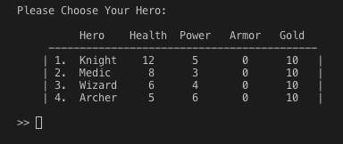
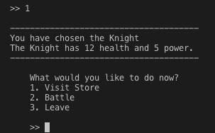
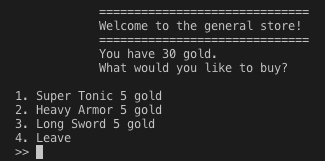
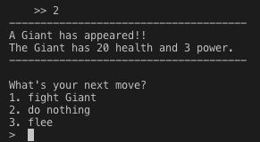
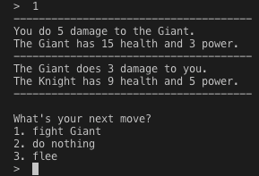
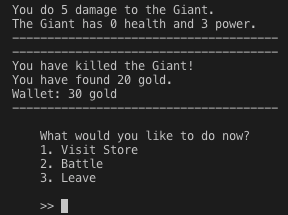

# RPG GAME IN COMMAND LINE
This is a terminal based RPG Game programed in Python 3. I made this game in Week 2 of DigitalCrafts. The main purpose of this project is to learn the fundamentals of Object Oriented Programming. 

## Characters
<h4>Select your hero (4 hero types)</h4>

---

## Actions
Here is the list of actions that the player can take. You can visit the store, battle or leave the game.

<ol>
<li>Visit the store.</li>
<h4>You can purchase items to use in battle.</h4>
Super Tonic gives additional health. Heavy Armor will provide a shield. Long Sword gives bonus attack power.

<li>Battle</li>
<h4>Enemies are randomized (4 enemies types)</h4>

You can battle enemies, do nothing or run-away.

* Fight enemy

* Do nothing

The enemy will attack you.

* Flee

This will take you to the menu.

<li>You have killed the enemy!</li>

Gold has been placed in your wallet to use in the store.

</ol>

---

## How to play
<ol>
<li>If you don't have python3 (If you have Python3, skip this.)
download python 3 for your OS.</li>
https://www.python.org/downloads/

Make sure your dependencies are all there

<li>Clone this repo to your local machine.</li>
https://github.com/Chris-Humphrey/RPG-game

<li>Open Terminal and play!</li>
</ol>

## Language
<ul><li> Python3 </li></ul>
